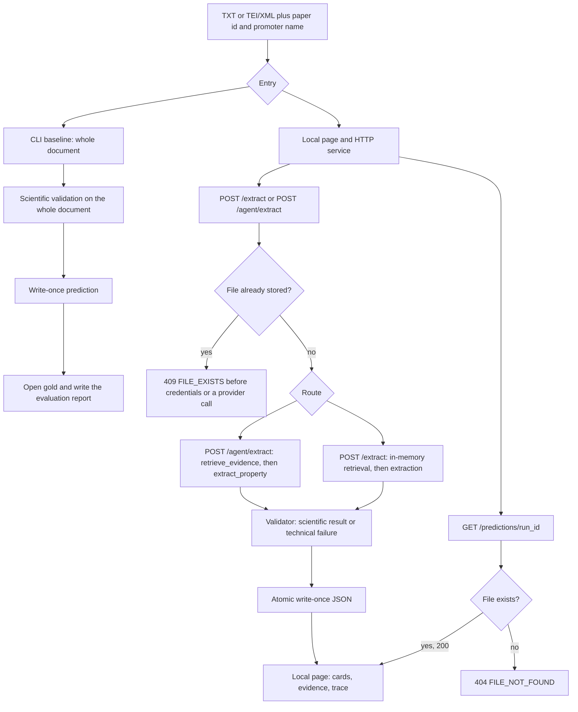

# Architecture and scientific workflow

How `promoter-ai-extraction` turns one article and one promoter identity into four evidenced results, and where the curated gold set is allowed to enter.

This guide describes the implemented application. Property rules, gold columns, and scoring formulas stay in the root contracts. When this page and a contract disagree, the contract wins.

| Contract | What it owns |
|---|---|
| [`project-overview.md`](../project-overview.md) | Scientific problem and product scope |
| [`project-requirements.md`](../project-requirements.md) | Required behavior |
| [`extraction-contract.md`](../extraction-contract.md) | Statuses, values, evidence, and property rules |
| [`gold-set-contract.md`](../gold-set-contract.md) | Curated table and what it is allowed to mean |
| [`evaluation-contract.md`](../evaluation-contract.md) | Comparison and metrics |
| [`ux-requirements.md`](../ux-requirements.md) | What the page must show and what it must not do |
| [`02-DOCS/wiki/sdd/constitution.md`](wiki/sdd/constitution.md) | Non-negotiable boundaries |

## Flow



`GET /predictions/{run_id}` does not enter the extraction path. It reads a file that was written earlier.

## Two extraction modes

Both modes ask for the same four properties: TSS, Caja −10, Caja −35, and factor sigma. They do not share a model conversation.

### Guided

The code chooses the order. For each property it builds a context and asks the provider once for that property.

- CLI: `uv run python -m promoter_ai_extraction.baseline`. The context is the whole loaded document. There is no retrieval step. After the prediction file exists, the CLI opens the gold workbook and writes a report.
- HTTP: `POST /extract`. The context is the retrieved slice for that property. HTTP does not open the gold set and does not write an evaluation report.

OpenAI `gpt-6.1-sol` is the default. Anthropic `claude-sonnet-5-5` is the other guided provider. There is no fallback from one to the other.

CLI output limit, if `--max-output-tokens` is omitted: 128000 for OpenAI and 4096 for Anthropic. A positive integer replaces that default. The HTTP service does not use the CLI default. On HTTP, an omitted `max_output_tokens` is 4096 for both providers. A supplied value must be an integer from 1 to 4096.

### Agent

`POST /agent/extract` accepts only `provider=anthropic`. The model may call two tools, and only with a `property` argument:

1. `retrieve_evidence` returns segment ids, scores, and context size. It does not return document text to the model in the tool result.
2. `extract_property` runs the same property extractor, with the promoter identity fixed by the server and the context already retrieved for that property.

`extract_property` does not run in the same model turn that requested `retrieve_evidence` for that property. The host returns the tool result first. The model has to ask for extraction on a later turn.

An unknown tool, an extra argument, or a property outside the four is rejected and not executed. The agent cannot change the paper, the promoter, a path, or the gold set.

Fixed budget: 6 orchestration rounds, 8 tool executions, 1024 output tokens per orchestration round, and 4096 output tokens per scientific extraction unless the client sends an integer from 1 to 4096. Retries are 0.

If the model stops before covering a property, that property is the technical code `AGENT_SKIPPED`. If the budget is exhausted, it is `AGENT_STEP_LIMIT`. An orchestrator error is `ORCHESTRATOR_ERROR`. Those three codes are technical failures. They are not scientific abstention statuses.

The 8-tool budget also counts rejected calls. Four retrievals and four extractions requested in a pattern that wastes the budget can stop the run before a later valid extraction.

## Validation

The validator is shared. The model does not assign the final status by itself.

Scientific statuses, defined in [`extraction-contract.md`](../extraction-contract.md), are:

- `EXTRACTED`
- `NOT_FOUND`
- `INSUFFICIENT_EVIDENCE`
- `UNSUPPORTED_MODALITY`
- `AMBIGUOUS`

`INVALID_CANDIDATE` is a reason to reject one candidate. It is not a property status. Rejected candidates stay out of the accepted values.

A technical failure is a different object. It has a stage and a code. It must not be stored or displayed as `NOT_FOUND` or as any other scientific status. Examples already implemented:

| Code | When |
|---|---|
| `INVALID_BACKEND_PAYLOAD` | An accepted-looking value came back with evidence identifiers and fragments that do not match |
| `INSUFFICIENT_RETRIEVAL` | Retrieval produced no usable segment |
| `PROVIDER_ERROR` | The provider call failed, including a rate limit |
| `MISSING_CREDENTIAL` | The selected provider key is absent. No provider call is made |
| `AGENT_SKIPPED`, `AGENT_STEP_LIMIT`, `ORCHESTRATOR_ERROR` | Agent control failures listed above |

On the synthetic agent trial, TSS ended as `INVALID_BACKEND_PAYLOAD`. Validation refused the inconsistent evidence. The other three properties on that synthetic document were `EXTRACTED`. That trial is not a corpus result. The note is [`process/2026-10-10-lidr-agent-live-verification.md`](process/2026-10-10-lidr-agent-live-verification.md).

Accepted values keep the reported text, the normalized value, the qualifier, and the evidence fragment with its segment id and location. A qualifier such as `putative` stays visible. Normalization does not promote it to a confirmed value. Normalizing an anchored distance also does not prove that the distance is the TSS rather than another regulatory feature. The TSS rules themselves are TSS-01 through TSS-09 in the extraction contract.

## Where gold is allowed

Gold is the curator table defined in [`gold-set-contract.md`](../gold-set-contract.md). It is an evaluation artifact.

- The extractor, the retrieval query, the agent tools, and the HTTP body must not receive gold fields. An extra field such as `gold_value` is HTTP `422 INVALID_REQUEST` before a provider call.
- A prediction used for evaluation is written first. Only the CLI opens the gold workbook, and only after that write. This is the persist-before-gold rule in the constitution.
- HTTP never evaluates. The local page has no benchmark action. Comparison with gold is out of the current interface, as `ux-requirements.md` places benchmark outside this increment.
- Splits are by paper. One paper id is not in both development and test. That rule is in the constitution and the evaluation contract.
- In the evaluation contract, “recuperación” means recovering a gold value. It does not mean that a retrieved segment was the curator’s sentence. The gold set does not systematically store those sentences, so the retrieval trace is not a segment precision or recall.

The CLI report has two views, defined in [`evaluation-contract.md`](../evaluation-contract.md). `end_to_end` is the main view: a technical failure on a gold target counts as not recovered. `scientific` is diagnostic and does not turn that failure into an abstention.

Metrics the evaluator can compute, per property, include `precision`, `recall`, `f1`, `exact_row_accuracy`, `recall_texto_explicito`, `recall_imagen_only`, `coverage`, and `technical_failure_rate`. Publishing those names is not the same as having measured them on the corpus. The corpus has not been scored. One Claude development case and one failed OpenAI control are recorded in [`process/2026-10-10-lidr-evaluation-evidence.md`](process/2026-10-10-lidr-evaluation-evidence.md).

## Local retrieval

Retrieval runs on the HTTP paths only. The CLI does not embed the document.

The index is built in memory for the document in that request. It is discarded afterward. The embedding model is `BAAI/bge-small-en-v1.5` through FastEmbed, loaded on first use rather than at import.

For each property, selection unions lexical anchors of the promoter name, the top 8 semantic neighbors, and the adjacent paragraph. There is no score threshold. The context passed to extraction is capped at 12000 characters. The public trace stores the model id, the mode, segment ids, and scores. It does not store vectors or the segment text.

If no usable segment remains, the property is the technical failure `INSUFFICIENT_RETRIEVAL`. If the local model cannot load, HTTP returns `503 EMBEDDER_UNAVAILABLE`.

## HTTP service and page

Start it with uv, from the repository root:

```bash
uv run uvicorn promoter_ai_extraction.api:app --host 127.0.0.1 --port 8765
```

The service listens on localhost. The client sends document text. It does not send a filesystem path, an API key, a gold field, or the prediction directory. `PREDICTION_DIR` is server configuration. The default directory is `runs/http`.

| Route | Role |
|---|---|
| `GET /` | Spanish extraction page |
| `GET /ui/app.css`, `GET /ui/app.js` | Page assets |
| `GET /health` | `status` and `software_version` `0.1.0`. No model and no embeddings |
| `POST /extract` | Guided HTTP extraction |
| `POST /agent/extract` | Agent extraction |
| `GET /predictions/{run_id}` | Read one saved prediction |

Closed request body for both POST routes:

| Field | Rule |
|---|---|
| `paper_id`, `promoter_name` | Non-empty text |
| `promoter_id`, `paper_gene_synonym` | Optional |
| `document_format` | `TXT` or `TEI/XML` |
| `document` | Text. Above 100000 characters: `413 DOCUMENT_TOO_LARGE` |
| `provider` | `openai` or `anthropic` on `/extract`. Only `anthropic` on `/agent/extract` |
| `max_output_tokens` | Optional integer from 1 to 4096 |

The page groups the form into article, promoter, and execution. Result cards separate an extracted value, a scientific abstention, and a technical failure. The detail sheet shows the fragment and its metadata, then rejected candidates in a separate block. The trace stays inside a collapsed disclosure until the reader opens it.

«Consultar resultado guardado» calls `GET /predictions/{paper_id}__{promoter_name}`. It does not require the file, the synonym, or the confirmation checkbox. «Extraer propiedades» stays disabled until the document, the identity, and the confirmation are present, and it stays disabled for an identity that was just saved.

## Immutable predictions

`run_id` is `paper_id__promoter_name`. Guided and agent routes share that id. The first successful file wins.

The write is atomic: a temporary file in the same directory, then a rename. A second POST for that id returns `409 FILE_EXISTS` before credentials are used and before retrieval or a provider call.

`GET` rebuilds the public card payload from the stored record. Stored keys are `tss`, `caja_10`, `caja_35`, and `sigma`, plus `system_fingerprint`. The response uses the public property names. It includes `agent` only when the fingerprint has an agent object, and `retrieval` only when it has a retrieval object. It does not return the filesystem path, the document hash, or a provider name that was not stored. Guided CLI fingerprints do not include provider or model, so the read route does not invent them.

An id containing `/`, `\`, `:`, or `..` is `422 INVALID_REQUEST`. A missing file is `404 FILE_NOT_FOUND`. A record that is not schema version 1, or whose internal `run_id` does not match the requested id, is refused rather than returned as a success. A symlink that resolves outside the store is refused and its contents are not returned.

## What this guide does not claim

- The automated gate is a software regression check. On `30b8489`, `./scripts/verify.sh` passed 639 tests. That number is not a precision, recall, or F1 on papers.
- One real development article has been through the guided Claude baseline. One OpenAI control of that same case failed with `PROVIDER_ERROR` / `RateLimitError`. Neither is a work-set score.
- One synthetic document has been through the live agent and the live page. The UI check shows that the page can complete a call and render the real JSON, including a technical failure. It does not add a second scientific case.
- Screenshots and `runs/` files stay outside Git.

## Read next

| Topic | Path |
|---|---|
| Knowledge map | [`wiki/index.md`](wiki/index.md) |
| Agent live check | [`process/2026-10-10-lidr-agent-live-verification.md`](process/2026-10-10-lidr-agent-live-verification.md) |
| UI live check | [`process/2026-10-10-lidr-live-ui-verification.md`](process/2026-10-10-lidr-live-ui-verification.md) |
| Evaluation boundary | [`process/2026-10-10-lidr-evaluation-evidence.md`](process/2026-10-10-lidr-evaluation-evidence.md) |
| Demo script | [`process/2026-10-10-lidr-demo-script.md`](process/2026-10-10-lidr-demo-script.md) |
