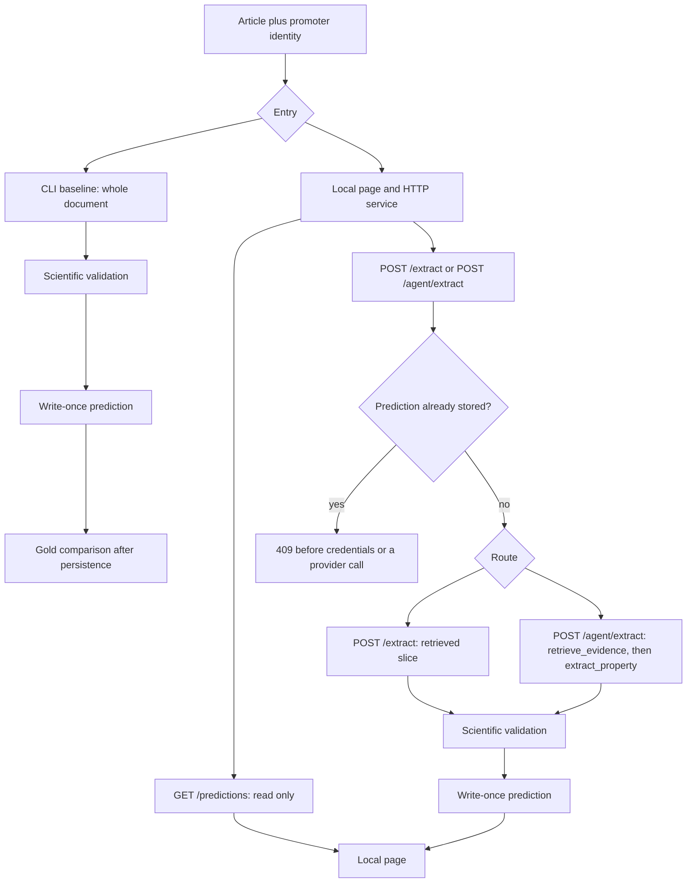

# promoter-ai-extraction

Leakage-safe extraction of four bacterial promoter properties from a scientific article.

[](pyproject.toml)
[](pyproject.toml)
[](pyproject.toml)
[](https://docs.astral.sh/uv/)

The badges repeat `pyproject.toml`: software version `0.1.0`, Python `>=3.11`, and a local FastAPI service installed with [uv](https://docs.astral.sh/uv/). They do not report CI, a license, or a scientific score.

## Scientific problem

RegulonDB stores promoter properties and the papers associated with a promoter. The historical record does not always say which sentence in which paper supports each value. A curator has to return to the article.

This system takes one article, as TXT or TEI/XML, and one promoter identity. It returns an independent result for each property, with evidence, or an explicit reason not to assert a value. The curated gold set is not an input to extraction.

The four properties are:

- TSS
- Caja −10
- Caja −35
- Factor sigma

Rules for values, abstention, and evidence stay in the root contracts. This page does not restate them.

## What the application does

- Guided extraction. On `POST /extract` the context is a retrieved slice of the supplied document. On the CLI the context is the whole document.
- An Anthropic agent that may only call `retrieve_evidence` and `extract_property`.
- Local semantic retrieval with FastEmbed. The index exists for that request and is not a corpus index.
- A local Spanish page for one confirmed extraction, or for reading a prediction that was already saved.
- Write-once JSON predictions. A repeated identity returns `409` before any provider call.
- A CLI baseline that extracts, stores the prediction, and only then opens the gold set.

The application does not discover promoters, write to RegulonDB, or compare against gold in the page.

## Flow



Detail, limits, and the role of gold: [`02-DOCS/architecture-and-scientific-workflow.md`](02-DOCS/architecture-and-scientific-workflow.md).

## Install and run

Python 3.11 and [uv](https://docs.astral.sh/uv/).

```bash
uv sync --all-groups
```

The development group is `pytest`. The test gate does not need an API key.

Neither the CLI nor Uvicorn loads a `.env` file. Export the key in the shell. Do not commit it. `.env` is gitignored.

| Variable | Used by |
|---|---|
| `OPENAI_API_KEY` | CLI and `POST /extract` when the provider is OpenAI |
| `ANTHROPIC_API_KEY` | CLI, `POST /extract` with Anthropic, and `POST /agent/extract` |
| `PREDICTION_DIR` | HTTP service only. Default: `runs/http` |

A missing key stops before the provider call: CLI exit `1` with `MISSING_CREDENTIAL`, or HTTP `503` with the same code. There is no automatic retry.

## Web page

From the repository root:

```bash
uv run uvicorn promoter_ai_extraction.api:app --host 127.0.0.1 --port 8765
```

Open `http://127.0.0.1:8765/`. The page talks only to that local service. It does not show the API key.

To extract, choose the article, the promoter, the method, and the provider, confirm a single provider call, and press «Extraer propiedades». The agent method uses Anthropic only.

To read a saved run, enter the same PMID/ID and promoter name and press «Consultar resultado guardado». That action does not send the document and does not call a provider. If the file is missing, the page shows the error. It does not rebuild the cards by extracting again.

`GET /health` returns `{"status":"ok","software_version":"0.1.0"}`.

## Guided extraction and agent

| Entry | Retrieval | Who chooses the next step | Provider |
|---|---|---|---|
| CLI `uv run python -m promoter_ai_extraction.baseline` | None. The whole document is the context. | The code, in fixed property order. | OpenAI by default, or Anthropic |
| `POST /extract` | Local, per property | The code, in fixed property order. | OpenAI by default, or Anthropic |
| `POST /agent/extract` | Local, only when the model calls the tool | The model, inside a fixed tool and round budget | Anthropic only |

Both HTTP routes share `run_id` = `paper_id__promoter_name`. The first saved file keeps that id. The other route returns `409` and does not overwrite it.

The CLI command, request fields, and numeric limits are in the [architecture guide](02-DOCS/architecture-and-scientific-workflow.md).

## Tests and limits

```bash
./scripts/verify.sh
```

On commit `30b8489` that gate passed 639 tests. They use fakes and synthetic fixtures. They do not call OpenAI or Anthropic. They are not 639 measurements of scientific precision, and they are not a corpus score. Re-run the script for the current count.

What has actually been seen outside the suite is narrower:

- One guided Claude run on one development article. It is not a work-set score.
- One OpenAI run of that same control, which failed technically with a provider rate limit and produced no scientific extraction.
- One synthetic agent call and one synthetic UI call. In the agent trial, TSS ended as `INVALID_BACKEND_PAYLOAD` because evidence identifiers and fragments did not match. Validation rejected that value. It was not stored as `EXTRACTED` or as `NOT_FOUND`.

Normalizing an anchored distance does not prove that the distance is the TSS. The gold set does not support a full false-claim rate or a segment-retrieval metric. The page does not run a benchmark and is not deployed beyond localhost.

The recorded boundary is [`02-DOCS/process/2026-10-10-lidr-evaluation-evidence.md`](02-DOCS/process/2026-10-10-lidr-evaluation-evidence.md).

## Future work

This is a proposal for how the system could evolve. It is not a list of implemented features. The roadmap starts with a bounded TSS normalization fix, then batch processing, then a systematic gold evaluation after predictions are stored. Later increments stay in the proposal until each one is specified and approved.

[`02-DOCS/future-work.md`](02-DOCS/future-work.md)

## Documentation

| Read | Path |
|---|---|
| Architecture and scientific workflow | [`02-DOCS/architecture-and-scientific-workflow.md`](02-DOCS/architecture-and-scientific-workflow.md) |
| Future work (proposal, not implemented) | [`02-DOCS/future-work.md`](02-DOCS/future-work.md) |
| Knowledge map | [`02-DOCS/wiki/index.md`](02-DOCS/wiki/index.md) |
| Constitution | [`02-DOCS/wiki/sdd/constitution.md`](02-DOCS/wiki/sdd/constitution.md) |
| Project definition | [`project-overview.md`](project-overview.md) |
| Requirements | [`project-requirements.md`](project-requirements.md) |
| Extraction rules | [`extraction-contract.md`](extraction-contract.md) |
| Gold set | [`gold-set-contract.md`](gold-set-contract.md) |
| Evaluation | [`evaluation-contract.md`](evaluation-contract.md) |
| Interface requirements | [`ux-requirements.md`](ux-requirements.md) |
